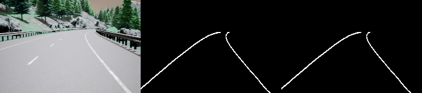

# Lane Segmentation with U-Net 🚗🔍


*U-Net Architecture Diagram (Reference)*

Implementation of a U-Net based deep learning model for lane segmentation in autonomous driving scenarios. Combines advanced techniques for handling class imbalance and data augmentation.

## Model Architecture
For details about the model structure, view the Netron-generated graph:

```plaintext
(assets/model.onnx.svg)
```

## Features 

-  Custom U-Net with dropout and batch normalization
-  Albumentations for data augmentation
-  Combined Focal Loss + Dice Loss for class imbalance
-  Mixed-precision training support
-  Comprehensive metrics (Pixel Accuracy, Dice Score)
-  Model checkpointing and prediction visualization

## Project Structure 

```plaintext
.
├── data/
│   ├── train/         		  # Training images (RGB)
│   ├── train_masks/   		  # Training masks (Binary)
│   ├── val/           		  # Validation images
│   └── val_masks/     		  # Validation masks
├── model.py                  # U-Net implementation
├── dataset.py                # Dataset & transforms
├── train.py                  # Training script
├── utils.py                  # Helper functions
├── saved_images/             # Prediction samples
├── my_checkpoint.pth.tar     # Trained model weights
└── README.md
```

## Requirements 

- Python 3.8+
- PyTorch 1.12+
- Torchvision 0.13+
- Albumentations 1.3+
- CUDA 11.6+ (recommended)
- NVIDIA GPU (recommended)

```sh
pip install torch torchvision albumentations tqdm numpy pillow
```

## Dataset Preparation 

- Download dataset from Kaggle.com - Lane Detection for Carla Driving Simulator
- Organize files:
```plaintext
data/
├── train/
│   ├── 0001.png
│   ├── 0002.png
│   └── ...
├── train_masks/
│   ├── 0001_label.png
│   ├── 0002_label.png
│   └── ...
└── ... (similar for validation)
```

## Training

Configure parameters in train.py:

```sh
# Hyperparameters
LEARNING_RATE = 0.001
BATCH_SIZE = 16
NUM_EPOCHS = 10
IMAGE_HEIGHT = 160
IMAGE_WIDTH = 240 
```

Start training:
```sh
python train.py
```

## Evaluation

Metrics are automatically calculated during training (example):
```sh
Got 4521893/4608000 with acc 98.13
Dice score: 0.8543
```

## Model Architecture

```sh
class UNET(nn.Module):
    def __init__(self, in_channels=3, out_channels=1, features=[64, 128, 256, 512]):
        # Custom U-Net with:
        - DoubleConv blocks with dropout
        - Learnable upsampling
        - Kaiming weight initialization
        - Skip connections
```

## Loss Functions

Combined loss function:
```sh
loss = 0.7 * FocalLoss() + 1.3 * DiceLoss()

class FocalLoss(nn.Module):
    def __init__(self, alpha=0.95, gamma=2.0):
        # Handles class imbalance

class DiceLoss(nn.Module):
    def forward(self, inputs, targets):
        # Optimizes for segmentation overlap
```

## Performance
```plaintext
| Metric          | Validation |
|-----------------|:----------:|
| Accuracy        | 99.46%     |
| Dice Score      | 0.815      |
| loss      	  | 0.129      |
```
*Tested on NVIDIA GeForce GTX 1050Ti GPU*


  
*Input | Binary Prediction | Raw Prediction*


Developed by: Team07 - SEA:ME Portugal  
